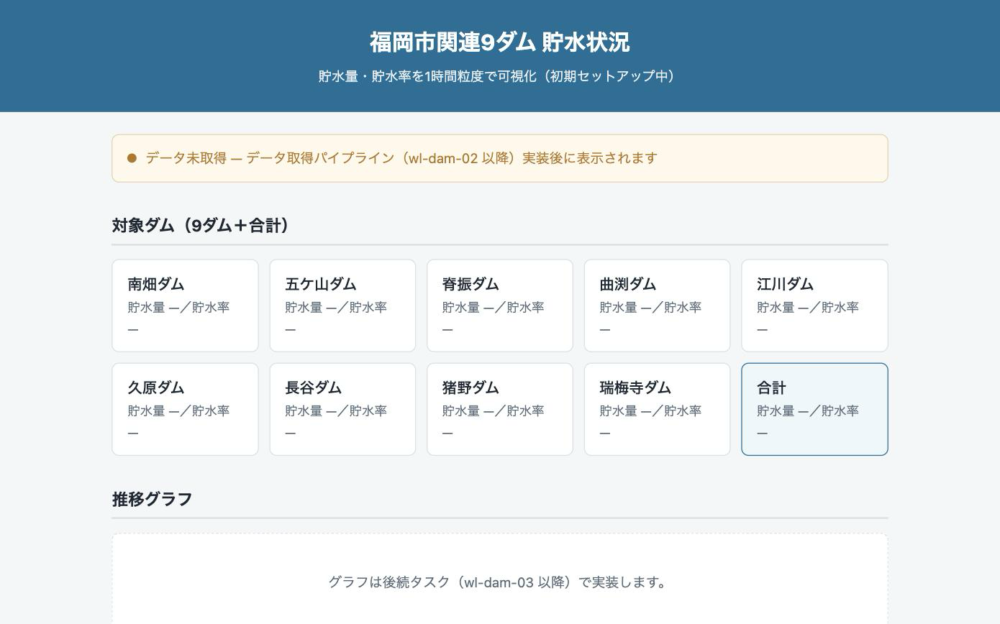

# fukuoka-dam-watch

福岡市関連9ダム（南畑・五ケ山・脊振・曲渕・江川・久原・長谷・猪野・瑞梅寺）の
**貯水量・貯水率を1時間粒度で可視化する静的サイト**。

福岡市のオープンデータ（BODIK 配信）を毎正時取得・正規化し、
9ダム個別＋合計の現在値と 24h / 7d / 30d の推移グラフを表示する。

## 状態

- `wl-dam-01` — サイト雛形（配置済み）
- `wl-dam-02` — データ取得・正規化スクリプト（`scripts/fetch-dams.mjs`、**実装済み**）
- `wl-dam-03` — GitHub Actions 毎正時更新 ＋ 推移グラフ（未実装、`org/weekend-lab/backlog.json` を参照）

フロントの現在値表示・グラフ描画は、実データが無くても `data/*.sample.json` で開発できる。

## 公開 URL（予定）

<https://dtakamiya.github.io/fukuoka-dam-watch/>

GitHub Pages（`main` ブランチのルート）で公開する想定。ルート直下に `index.html` と
`.nojekyll`（Jekyll 処理を無効化）を置いてある。Pages の有効化操作は別途行う。

## ローカル確認手順

ビルドステップはない。以下のいずれかで確認できる。

```sh
# 方法1: ファイルを直接開く
open index.html

# 方法2: 簡易 HTTP サーバ（相対パス・fetch を伴う後続タスクの確認向け）
python3 -m http.server 8000
# → http://localhost:8000/ をブラウザで開く
```

確認ポイント: ヘッダ「福岡市関連9ダム 貯水状況」／9ダム名＋「合計」のカード一覧／
「データ未取得」バナー／フッタの出典表記（福岡市オープンデータ / BODIK）が表示されること。
JS 構文チェックは `node --check assets/app.js`。

## スクリーンショット



## 使用ライブラリ

- 推移グラフは **Chart.js**（CDN 参照・バンドラなし）を採用予定。ライブラリは1つに限定する。
  `wl-dam-03` で `assets/app.js` に実装する。

## データソース

| 項目 | 内容 |
| --- | --- |
| データセット | [福岡市関連9ダム貯水量（BODIK）](https://data.bodik.jp/dataset/d54fb22e-5b64-485c-8816-69f27ed1aaf1) |
| CSV | `https://data.bodik.jp/dataset/d54fb22e-5b64-485c-8816-69f27ed1aaf1/resource/a5b26052-26d1-4c7a-b63f-5736de453bc1/download/YYYYMMdata.csv` |
| 粒度 | 毎正時1時間ごと・**当月分のみのローリング**（月初〜現在時刻） |
| 文字コード | Shift_JIS（BOMなし）・単位は千m3（千立方メートル） |
| 列 | `観測時刻, 南畑ダム, 五ケ山ダム, 脊振ダム, 曲渕ダム, 江川ダム, 久原ダム, 長谷ダム, 猪野ダム, 瑞梅寺ダム, 合計,`（末尾カンマあり／値は貯水量の整数） |
| 利水容量・貯水率の HTML | `.../resource/68982ce3-1c11-49df-b084-3a1049673bdf/download/realtime-list.html`（各ダムの利水容量）／`.../resource/1e5c7a5f-.../download/realtime-total.html`（合計貯水率の公表値） |
| 参考（出典表記用） | [福岡市「きょうのダム状況」](https://www.city.fukuoka.lg.jp/mizu/mizukanri/machi/002.html) |

### データ源の制約（実装で判明）

- CSV リソースは **ファイル名の `YYYYMM` 接頭辞を無視し、常に当月分のローリングファイルだけを返す**。
  過去月のアーカイブ URL は存在しない（`202608data.csv` を要求しても当月分と同じ内容が返る）。
- したがって 35 日分の時系列を1回の取得で得ることはできない。`fetch-dams.mjs` は毎正時実行で
  取得した最新の正時を **既存の `data/history.json` に追記して時系列を自前で累積**する。
  導入直後〜数日は 35 日に満たず、その間は `bootstrapping: true` フラグで示す。
- 静的サイトからの直接 fetch は CORS と文字コードの都合で不可。GitHub Actions（`wl-dam-03`）で
  毎正時 `CSV → UTF-8 JSON` に正規化してコミットし、サイトはその JSON を読む。

## 貯水率の算出方式

**採用: 案A（利水容量の定数テーブルで算出）。** 各ダムの貯水量（CSV 値, 千m3）を
利水容量で割って `貯水率(%) = 貯水量 ÷ 利水容量 × 100`（小数第1位で四捨五入）。

- 根拠: この方式で計算した合計貯水率が福岡市水道局の公表値と一致する。
  2026-09-06 14:00 時点で 合計 `39,268 ÷ 76,877 = 51.1%`、公表値（`realtime-total.html`）も **51.1%**。
- 利水容量の出典: BODIK 同データセットの HTML リソース
  [`realtime-list.html`](https://data.bodik.jp/dataset/d54fb22e-5b64-485c-8816-69f27ed1aaf1/resource/68982ce3-1c11-49df-b084-3a1049673bdf/download/realtime-list.html)
  に「利水容量」として明記されている値（単位: 千m3）。
- 案B（`realtime-list.html` を毎回パースして率を得る）を採らない理由: HTML 構造変更に弱く、
  取得先が1つ増える。定数化すれば依存が減り、値の妥当性も公表値との一致で検証済み。
  利水容量が改訂されたら下表と `scripts/fetch-dams.mjs` の `DAMS[].capacity` を更新する。

| ダム | key | 利水容量（千m3） |
| --- | --- | ---: |
| 南畑ダム | `minamibata` | 3,650 |
| 五ケ山ダム | `gokayama` | 31,700 |
| 脊振ダム | `sefuri` | 3,979 |
| 曲渕ダム | `magaribuchi` | 2,368 |
| 江川ダム | `egawa` | 24,000 |
| 久原ダム | `kubara` | 1,460 |
| 長谷ダム | `hase` | 4,850 |
| 猪野ダム | `ino` | 3,650 |
| 瑞梅寺ダム | `zuibaiji` | 1,220 |
| 9ダム合計 | `total` | 76,877 |

## JSON スキーマ

`scripts/fetch-dams.mjs` が `data/` に2ファイルを生成する。フロント開発用に同スキーマの
ダミーデータ `data/latest.sample.json` / `data/history.sample.json`（合成値・35日分）を
コミットしてある（`_note` フィールドでサンプルと明示）。

### `data/latest.json` — 最新1時点

```jsonc
{
  "generatedAt": "2026-09-06T05:44:19.960Z", // スクリプト実行時刻（UTC ISO 8601）
  "observedAt":  "2026-09-06T14:00:00+09:00", // 最新の観測時刻（JST ISO 8601）
  "unit": "千m3",
  "bootstrapping": true,                      // 時系列がまだ35日未満なら true
  "source": { "name": "...", "dataset": "https://...", "attribution": "https://..." },
  "dams": [                                   // 9ダム（CSV 列順）
    { "key": "minamibata", "name": "南畑ダム", "storage": 2597, "capacity": 3650, "rate": 71.2 }
    // ...
  ],
  "total": { "key": "total", "name": "9ダム合計", "storage": 39268, "capacity": 76877, "rate": 51.1 }
}
```

### `data/history.json` — 時系列（直近 `retainDays` 日・昇順）

```jsonc
{
  "generatedAt": "2026-09-06T05:44:19.960Z",
  "unit": "千m3",
  "retainDays": 40,                           // 保持する日数（最低35を確保する上限側の設定）
  "bootstrapping": true,
  "spanDays": 5.6,                            // series が実際にカバーしている日数
  "dams": [ { "key": "minamibata", "name": "南畑ダム" }, /* ... */ { "key": "total", "name": "9ダム合計" } ],
  "capacities": { "minamibata": 3650, /* ... */ "total": 76877 },
  "series": [                                 // 古い順。毎正時1点
    {
      "observedAt": "2026-09-01T00:00:00+09:00",
      "storage": { "minamibata": 2601, /* ... */ "total": 41788 },
      "rate":    { "minamibata": 71.3, /* ... */ "total": 54.4 }
    }
    // ...
  ]
}
```

## データ取得スクリプトの実行方法

```sh
node scripts/fetch-dams.mjs          # data/latest.json と data/history.json を生成／更新
node scripts/make-sample-data.mjs    # data/*.sample.json を再生成（フロント開発用ダミー）
```

- 依存ゼロ（Node 標準モジュールのみ、Node 18+ 必須。`TextDecoder('shift_jis')` を使用）。
- 当月 CSV の取得・デコード・パースに失敗した場合は **既存の `data/*.json` を書き換えず** に
  理由を stderr に出して exit 1。成功時のみ一時ファイル経由で原子的に差し替える。
- 前月 CSV の欠落や既存 `history.json` の破損は警告のみで続行する。
- 環境変数（CI・デバッグ用）:
  - `FETCH_DAMS_LOCAL_DIR=<dir>` — HTTP 取得の代わりに `<dir>/YYYYMMdata.csv` を読む（オフライン擬似実行）
  - `FETCH_DAMS_BASE_URL=<url>` — CSV ダウンロード URL のベースを差し替える（失敗系テスト用）
  - `FETCH_DAMS_RETAIN_DAYS=<n>` — `history.json` に残す日数（既定 40）

## 開発

週末ラボ（`~/.ryoko/org/weekend-lab/`）のプロダクト。土日の2枠で少しずつ進める。

## ライセンス

MIT（本リポジトリのコード）。ダムのデータは福岡市オープンデータの利用条件に従う。
