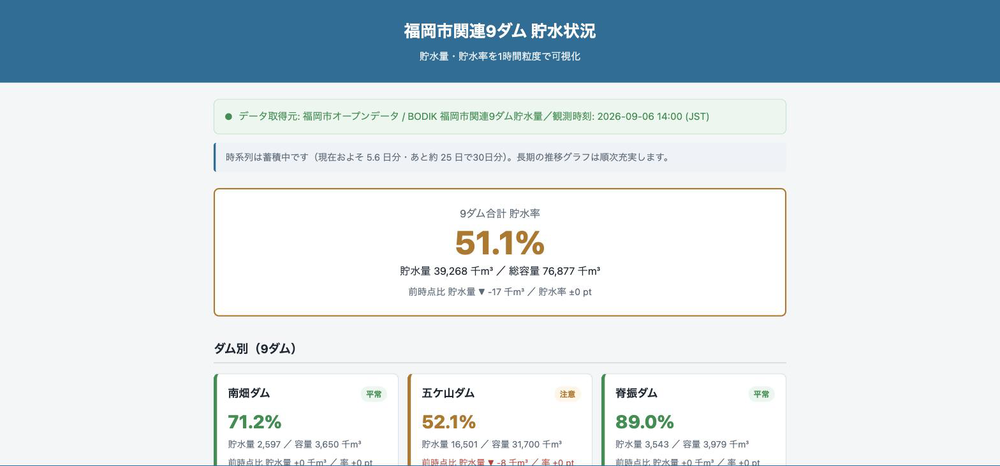
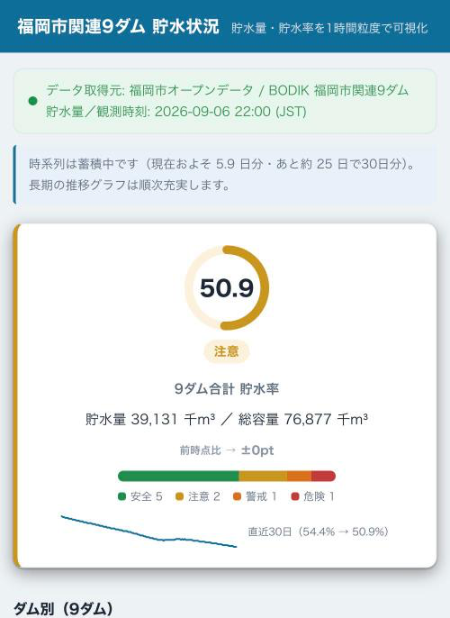
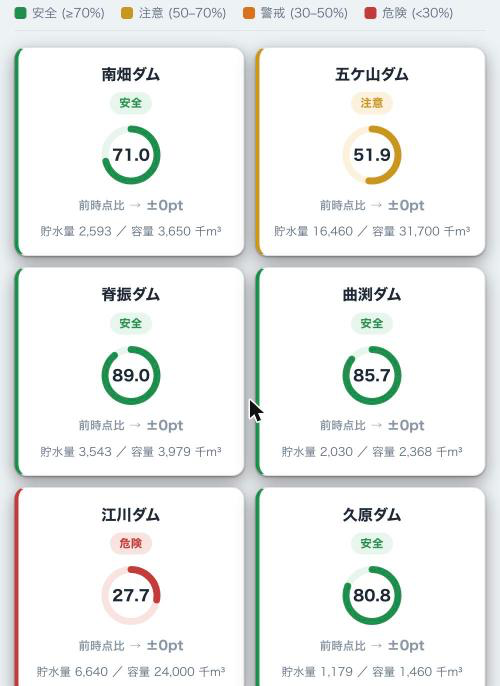
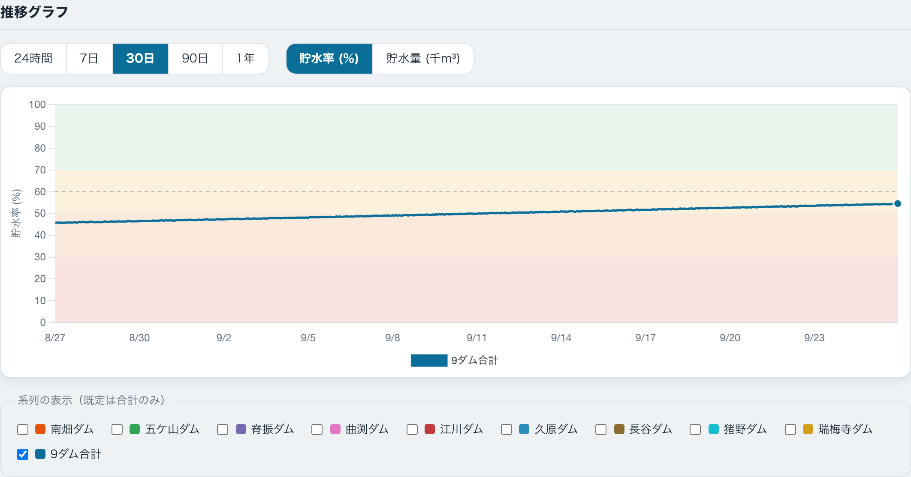
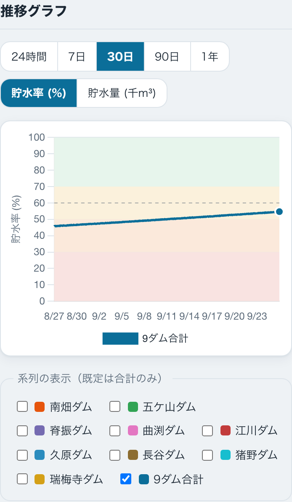
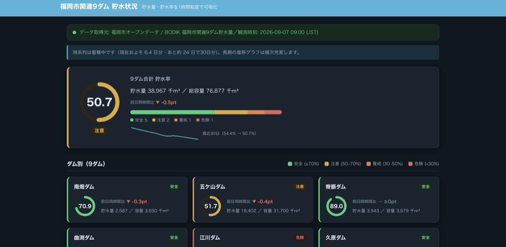

# fukuoka-dam-watch

福岡市関連9ダム（南畑・五ケ山・脊振・曲渕・江川・久原・長谷・猪野・瑞梅寺）の
**貯水量・貯水率を1時間粒度で可視化する静的サイト**。

福岡市のオープンデータ（BODIK 配信）を毎正時取得・正規化し、
9ダム個別＋合計の現在値と 24h / 7d / 30d の推移グラフを表示する。

## 状態

**MVP 完成。** 現在値ビューと推移グラフが動作し、GitHub Actions が毎正時データを更新する。

| タスク | 内容 | 状態 |
| --- | --- | --- |
| `wl-dam-01` | サイト雛形 | ✅ |
| `wl-dam-02` | データ取得・正規化スクリプト（`scripts/fetch-dams.mjs`） | ✅ |
| `wl-dam-03` | GitHub Actions 毎正時データ更新（`.github/workflows/update-data.yml`） | ✅ |
| `wl-dam-04` | 現在値ビュー（9ダム個別カード＋合計サマリ・前時点比・色分け） | ✅ |
| `wl-dam-05` | 推移グラフ（Chart.js・24h / 7d / 30d トグル・指標切替・系列 on/off） | ✅ |
| `wl-dam-06` | 仕上げ（出典・ライセンス表記の確定、スクリーンショット整理、最終確認） | ✅ |
| `design-v1` | デザイン刷新（リングゲージ・4段階しきい値・内訳バー・スパークライン・グラフのゾーン帯・モバイル2列タイル・ダークモード） | ✅ |

フロントの現在値表示・グラフ描画は、実データが無くても `data/*.sample.json` で開発できる。

## 公開 URL（予定）

<https://dtakamiya.github.io/fukuoka-dam-watch/>

GitHub Pages（`main` ブランチのルート）で公開する想定。ルート直下に `index.html` と
`.nojekyll`（Jekyll 処理を無効化）を置いてある。Pages の有効化操作は別途行う。

## ローカル確認手順

ビルドステップはない。以下のいずれかで確認できる。

```sh
# 方法1: ファイルを直接開く
open index.html

# 方法2: 簡易 HTTP サーバ（相対パス・fetch を伴う後続タスクの確認向け）
python3 -m http.server 8000
# → http://localhost:8000/ をブラウザで開く
```

確認ポイント: ヘッダ「福岡市関連9ダム 貯水状況」／合計サマリ（貯水率リング＋状態ラベル＋内訳バー＋スパークライン）／
9ダム個別カード（円形リングゲージ・貯水量・前時点比・安全/注意/警戒/危険の 4 段階色分け）／観測時刻と取得元の表示／
フッタの出典表記（福岡市オープンデータ / BODIK）。実データが読めない場合は
`data/*.sample.json` にフォールバックし「サンプルデータ表示中」バッジが出ること。
推移グラフが描画され、24時間 / 7日 / 30日トグル（**初期表示は 30日**）・指標（貯水率 / 貯水量）切替・
系列 on/off（既定は合計のみ）が動くこと。貯水率表示時はグラフ背景にしきい値ゾーン帯が出ること。
スマホ幅（`<= 540px`）で 9 ダムが 2 列タイルになり、OS のダークモードで配色が切り替わること。
JS 構文チェックは `node --check assets/app.js`。

### ローカル開発時のデータ

`data/latest.json` / `data/history.json`（実データ）は Git 管理外で、GitHub Actions
（`.github/workflows/update-data.yml`）が毎正時に生成・コミットする。ローカルや初回 Action 実行前は
これらが存在しないため、フロント（wl-dam-04 以降）は **実データの取得に失敗したら
`data/*.sample.json`（30 日分の合成ダミー・リポジトリにコミット済み）にフォールバック** する。
実データを手元で作りたい場合は `node scripts/fetch-dams.mjs` を実行する。

## スクリーンショット

> デザイン提案 v1（`docs/design-proposal-v1.md`）反映後の画面。貯水率は SVG 円形リングゲージで可視化し、
> しきい値は 4 段階（安全 ≥70% ／ 注意 50–70% ／ 警戒 30–50% ／ 危険 <30%）に拡張した。
> 境界値 70 / 50 / 30 は運用検討用の仮値（`assets/app.js` のしきい値コメント参照）。

### 現在値ビュー

情報階層は「合計リング＋状態ラベル → 9ダム 3 列グリッド → 推移グラフ」。合計サマリはリングに加えて
内訳セグメントバー（安全／注意／警戒／危険の本数）と直近 30 日のスパークラインを持つ。
前時点比は貯水率のみ 1 系統に集約し、数値の下に「前時点比 ▲+0.2pt」相当を出す（▲上昇＝緑 /
▼下降＝赤 / →横ばい＝グレー）。色に依存しないよう形状アイコンと `aria-label`（例「前時点比 貯水率
上昇 0.3ポイント」）でも増減を伝える。左端の色帯は貯水率ステータスで、増減とは独立。

| デスクトップ | 狭幅（スマホ相当） |
| --- | --- |
|  |  |

スマホ幅（`<= 540px`）では 9 ダムを 2 列タイルで一望できる。



### 推移グラフ

合計貯水率の推移。24時間 / 7日 / 30日トグル（初期表示は 30日）・指標（貯水率 / 貯水量）切替・系列 on/off。
貯水率表示時は背景にしきい値ゾーン帯（安全／注意／警戒／危険）を敷き、y 軸を 0–100 に固定、平常ライン
（60%）を破線、末尾に現在値マーカーを打つ（Chart.js のプラグイン追加なし・自前の inline plugin）。

| デスクトップ | 狭幅（スマホ相当） |
| --- | --- |
|  |  |

### ダークモード

`prefers-color-scheme: dark` に対応。レイアウトは共通でトークンのみ差し替え、水色アクセントは明度を上げて維持する。



> 狭幅ショットはブラウザウィンドウを 430px 幅に絞り `@media (max-width: 540px)` のスタイルを適用して撮影。
> ライト系ショットは撮影環境が OS ダーク設定のため、`:root` のカラートークンを一時的にライト値へ
> 差し替えて撮影している（`@media (prefers-color-scheme: dark)` の配線自体は別途ダークショットで確認済み）。

## 使用ライブラリ

- 推移グラフは **Chart.js**（`cdn.jsdelivr.net` から CDN 参照・バンドラなし）。
  外部依存はこの1つに限定する。`assets/app.js` の wl-dam-05 セクションで実装。

## データソース

| 項目 | 内容 |
| --- | --- |
| データセット | [福岡市関連9ダム貯水量（BODIK）](https://data.bodik.jp/dataset/d54fb22e-5b64-485c-8816-69f27ed1aaf1) |
| CSV | `https://data.bodik.jp/dataset/d54fb22e-5b64-485c-8816-69f27ed1aaf1/resource/a5b26052-26d1-4c7a-b63f-5736de453bc1/download/YYYYMMdata.csv` |
| 粒度 | 毎正時1時間ごと・**当月分のみのローリング**（月初〜現在時刻） |
| 文字コード | Shift_JIS（BOMなし）・単位は千m3（千立方メートル） |
| 列 | `観測時刻, 南畑ダム, 五ケ山ダム, 脊振ダム, 曲渕ダム, 江川ダム, 久原ダム, 長谷ダム, 猪野ダム, 瑞梅寺ダム, 合計,`（末尾カンマあり／値は貯水量の整数） |
| 利水容量・貯水率の HTML | `.../resource/68982ce3-1c11-49df-b084-3a1049673bdf/download/realtime-list.html`（各ダムの利水容量）／`.../resource/1e5c7a5f-.../download/realtime-total.html`（合計貯水率の公表値） |
| 参考（出典表記用） | [福岡市「きょうのダム状況」](https://www.city.fukuoka.lg.jp/mizu/mizukanri/machi/002.html) |

### データ源の制約（実装で判明）

- CSV リソースは **ファイル名の `YYYYMM` 接頭辞を無視し、常に当月分のローリングファイルだけを返す**。
  過去月のアーカイブ URL は存在しない（`202608data.csv` を要求しても当月分と同じ内容が返る）。
- したがって 35 日分の時系列を1回の取得で得ることはできない。`fetch-dams.mjs` は毎正時実行で
  取得した最新の正時を **既存の `data/history.json` に追記して時系列を自前で累積**する。
  導入直後〜数日は 35 日に満たず、その間は `bootstrapping: true` フラグで示す。
- 静的サイトからの直接 fetch は CORS と文字コードの都合で不可。GitHub Actions（`wl-dam-03`）で
  毎正時 `CSV → UTF-8 JSON` に正規化してコミットし、サイトはその JSON を読む。

## 貯水率の算出方式

**採用: 案A（利水容量の定数テーブルで算出）。** 各ダムの貯水量（CSV 値, 千m3）を
利水容量で割って `貯水率(%) = 貯水量 ÷ 利水容量 × 100`（小数第1位で四捨五入）。

- 根拠: この方式で計算した合計貯水率が福岡市水道局の公表値と一致する。
  2026-09-06 14:00 時点で 合計 `39,268 ÷ 76,877 = 51.1%`、公表値（`realtime-total.html`）も **51.1%**。
- 利水容量の出典: BODIK 同データセットの HTML リソース
  [`realtime-list.html`](https://data.bodik.jp/dataset/d54fb22e-5b64-485c-8816-69f27ed1aaf1/resource/68982ce3-1c11-49df-b084-3a1049673bdf/download/realtime-list.html)
  に「利水容量」として明記されている値（単位: 千m3）。
- 案B（`realtime-list.html` を毎回パースして率を得る）を採らない理由: HTML 構造変更に弱く、
  取得先が1つ増える。定数化すれば依存が減り、値の妥当性も公表値との一致で検証済み。
  利水容量が改訂されたら下表と `scripts/fetch-dams.mjs` の `DAMS[].capacity` を更新する。

| ダム | key | 利水容量（千m3） |
| --- | --- | ---: |
| 南畑ダム | `minamibata` | 3,650 |
| 五ケ山ダム | `gokayama` | 31,700 |
| 脊振ダム | `sefuri` | 3,979 |
| 曲渕ダム | `magaribuchi` | 2,368 |
| 江川ダム | `egawa` | 24,000 |
| 久原ダム | `kubara` | 1,460 |
| 長谷ダム | `hase` | 4,850 |
| 猪野ダム | `ino` | 3,650 |
| 瑞梅寺ダム | `zuibaiji` | 1,220 |
| 9ダム合計 | `total` | 76,877 |

## JSON スキーマ

`scripts/fetch-dams.mjs` が `data/` に2ファイルを生成する（Git 管理外・Actions が生成）。
フロント開発用に同スキーマのダミーデータ `data/latest.sample.json`（pretty）/
`data/history.sample.json`（30 日分・サイズ削減のため minify）をコミットしてある
（`_note` フィールドでサンプルと明示）。

### `data/latest.json` — 最新1時点

```jsonc
{
  "generatedAt": "2026-09-06T05:44:19.960Z", // スクリプト実行時刻（UTC ISO 8601）
  "observedAt":  "2026-09-06T14:00:00+09:00", // 最新の観測時刻（JST ISO 8601）
  "unit": "千m3",
  "bootstrapping": true,                      // 時系列がまだ35日未満なら true
  "source": { "name": "...", "dataset": "https://...", "attribution": "https://..." },
  "dams": [                                   // 9ダム（CSV 列順）
    { "key": "minamibata", "name": "南畑ダム", "storage": 2597, "capacity": 3650, "rate": 71.2 }
    // ...
  ],
  "total": { "key": "total", "name": "9ダム合計", "storage": 39268, "capacity": 76877, "rate": 51.1 }
}
```

### `data/history.json` — 時系列（直近 `retainDays` 日・昇順）

```jsonc
{
  "generatedAt": "2026-09-06T05:44:19.960Z",
  "unit": "千m3",
  "retainDays": 40,                           // 保持する日数（最低35を確保する上限側の設定）
  "bootstrapping": true,
  "spanDays": 5.6,                            // series が実際にカバーしている日数
  "dams": [ { "key": "minamibata", "name": "南畑ダム" }, /* ... */ { "key": "total", "name": "9ダム合計" } ],
  "capacities": { "minamibata": 3650, /* ... */ "total": 76877 },
  "series": [                                 // 古い順。毎正時1点
    {
      "observedAt": "2026-09-01T00:00:00+09:00",
      "storage": { "minamibata": 2601, /* ... */ "total": 41788 },
      "rate":    { "minamibata": 71.3, /* ... */ "total": 54.4 }
    }
    // ...
  ]
}
```

## データ取得スクリプトの実行方法

```sh
node scripts/fetch-dams.mjs          # data/latest.json と data/history.json を生成／更新
node scripts/make-sample-data.mjs    # data/*.sample.json を再生成（フロント開発用ダミー）
```

- 依存ゼロ（Node 標準モジュールのみ、Node 18+ 必須。`TextDecoder('shift_jis')` を使用）。
- 当月 CSV の取得・デコード・パースに失敗した場合は **既存の `data/*.json` を書き換えず** に
  理由を stderr に出して exit 1。成功時のみ一時ファイル経由で原子的に差し替える。
- 前月 CSV の欠落や既存 `history.json` の破損は警告のみで続行する。
- 観測値に変化が無い正時は `generatedAt` だけの書き換えを行わない（ファイルが変化しない）。
- 環境変数（CI・デバッグ用）:
  - `FETCH_DAMS_LOCAL_DIR=<dir>` — HTTP 取得の代わりに `<dir>/YYYYMMdata.csv` を読む（オフライン擬似実行）
  - `FETCH_DAMS_BASE_URL=<url>` — CSV ダウンロード URL のベースを差し替える（失敗系テスト用）
  - `FETCH_DAMS_RETAIN_DAYS=<n>` — `history.json` に残す日数（既定 40）

## 自動更新

データ更新（CSV 取得 → `data/latest.json` / `data/history.json` の再生成 → 差分コミット）は
GitHub Actions ワークフロー `.github/workflows/update-data.yml` が実行する。
このワークフローを起動するトリガーは **2 系統**あり、主・保険の役割が分かれている。

| トリガー | 主/保険 | 実体 | 挙動 |
|---|---|---|---|
| ローカル `launchd` | **主トリガー** | だいすけの Mac 上の `com.dtakamiya.fukuoka-dam-watch-dispatch` が毎時 :17 / :47 に `scripts/dispatch-update-data.sh` を実行し、`gh workflow run update-data.yml` で `workflow_dispatch` を投げる | 発火が正確。ただし Mac スリープ中は動かず、復帰時にまとめて catch-up する |
| GitHub `schedule` | 保険（冗長） | `update-data.yml` の `on.schedule: "7,37 * * * *"`（毎時07分・37分） | GitHub ホスト型 schedule は発火が大きく遅れる・混雑時にドロップすることがあるため、主トリガー扱いにはしない |

### `scripts/dispatch-update-data.sh`（主トリガーのディスパッチャ）

- launchd の最小 PATH でも `gh` を解決できるよう Homebrew のパスを明示している。
- `gh` が見つからなければ exit 127 で明示終了する（launchd のログで失敗が分かる）。
- **このスクリプトはリポジトリ管理下にある。** 過去に Git 未追跡のローカルファイルとして
  存在していた時期に、ブランチ操作中の untracked ファイル削除で消失し、launchd が
  exit 127 を繰り返して毎時ディスパッチが停止した事故があった（2026-09-06）。
  以降は追跡ファイルとしてコミットしてあるので `git checkout` / `git clean` で消えない。
- データ鮮度は Ryoko の cron ジョブ `weekend-lab-dam-freshness`（毎日 10:23 / 20:23 JST）が
  監視しており、`update-data` の run が直近 3 時間 1 件も無い（= launchd 停止）場合も
  異常として検知し、自己修復ディスパッチ＋ Slack 通知する。

### launchd のセットアップ（だいすけの Mac）

plist テンプレート `scripts/com.dtakamiya.fukuoka-dam-watch-dispatch.plist` を
リポジトリ管理下に置いてある（消失事故を防ぐため、スクリプトと同様に追跡ファイル化）。
実体は `~/Library/LaunchAgents/` に配置する。パスは dtakamiya 環境の絶対パス固定。

```sh
cp scripts/com.dtakamiya.fukuoka-dam-watch-dispatch.plist ~/Library/LaunchAgents/
launchctl bootstrap gui/$(id -u) ~/Library/LaunchAgents/com.dtakamiya.fukuoka-dam-watch-dispatch.plist
launchctl kickstart -k gui/$(id -u)/com.dtakamiya.fukuoka-dam-watch-dispatch   # 手動発火して確認
```

解除は `launchctl bootout gui/$(id -u)/com.dtakamiya.fukuoka-dam-watch-dispatch`。
plist を更新したら `bootout` → `bootstrap` で入れ直す。
標準出力・標準エラーは `tmp/launchd.out` / `tmp/launchd.err`（いずれも Git 管理外）。

### 画面への反映（クライアント側の自動更新）

ページは初回表示に加え、**10分ごと**および**タブがバックグラウンドから復帰したとき**
（直近取得から2分以上経過している場合）に `data/*.json` を再取得して再描画する。
そのため、ページを開いたままでも手動リロードなしで最新値が反映される。
グラフの期間・指標・系列トグルの選択状態は再取得後も維持される。
再取得が一時的に失敗しても、その時点の表示はそのまま保持する。

### GitHub Actions の詳細

- **手動実行**: Actions タブ → **update-data** → **Run workflow**（`workflow_dispatch`）。
  初回運用や Pages 公開直後の初期データ投入はこれで行う。
- **差分判定**: 実データ2ファイルは `.gitignore` 対象なので `git add -f` で強制ステージし、
  `git diff --cached --quiet` で判定する。**差分があるときだけ** `github-actions[bot]` 名義で
  コミットして push する。BODIK 未更新の正時はファイルが変化しないためコミットされない。
- **権限**: `contents: write` のみ（push に必要な最小スコープ）。
- **失敗の可視化**: CSV 取得・パースに失敗すると `fetch-dams.mjs` が非ゼロ終了し、
  既存 JSON を保持したままジョブが失敗する（Actions 上で赤表示）。
- Node バージョンは `actions/setup-node` で固定（`22.11.0`）。
- `sample` データ（`data/*.sample.json`）はこのワークフローの対象外。

## 開発

週末ラボ（`~/.ryoko/org/weekend-lab/`）のプロダクト。土日の2枠で少しずつ進める。

## ライセンス

MIT（本リポジトリのコード）。ダムのデータは福岡市オープンデータの利用条件に従う。
